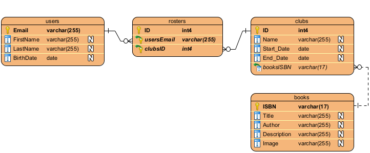

# MileStone2MERNproject
# Express App
# Entity Relationship Diagram (ERD)    

# CRUD Routes   (All SQL errors result in Server Error 500)
## Create Routes (POST)
| Table     | Routes          | Results 
|-----------|-----------------|---------
| Books     | /Books {JSON}   | {isbn} on Success or Server Error 500
| Clubs     | /Clubs {JSON}   | {name} on Success or Server Error 500
| Rosters   | /Rosters {JSON} | {usersemail} on Success or Server Error 500
| Users     | /Users {JSON}   | {email} on Success or Server Error 500

## Read Routes (GET)
| Table     | Routes                  | Results 
|-----------|-------------------------|---------
| Books     | /Books                  | Array of Objects
| Books     | /Books/:isbn            | Single Object or NULL
| Clubs     | /Clubs                  | Array of Objects
| Clubs     | /Clubs/:id              | Single Object or NULL
| Rosters   | /Rosters                | Array of Objects
| Rosters   | /Rosters/:id            | Single Object or NULL
| Users     | /Users                  | Array of Objects
| Users     | /Users/:email           | Single Object or NULL
| BookClubs | /BookClubs              | Array of Objects
| BookClubs | /BookClubs/Books/:isbn  | Array of Objects or Empty Array
| BookClubs | /BookClubs/Clubs/:id    | Single Object or NULL
| BookClubs | /BookClubs/Rosters/:id  | Single Object or NULL
| BookClubs | /BookClubs/Users/:email | Single Object or NULL

## Update Routes (PUT)
| Table     | Routes              | Results 
|-----------|---------------------|---------
| Books     | /Books {JSON}       | {isbn} on Success or Server Error 500
| Clubs     | /Clubs/:id {JSON}   | {id} on Success or Server Error 500
| Rosters   | /Rosters/:id {JSON} | {id} on Success or Server Error 500
| Users     | /Users {JSON}       | {email} on Success or Server Error 500

## Delete Routes (Delete)
| Table     | Routes        | Results 
|-----------|---------------|---------
| Books     | /Books/:isbn  | Number of Rows Deleted
| Clubs     | /Clubs/:id    | Number of Rows Deleted
| Rosters   | /Rosters/:id  | Number of Rows Deleted
| Users     | /Users/:email | Number of Rows Deleted
